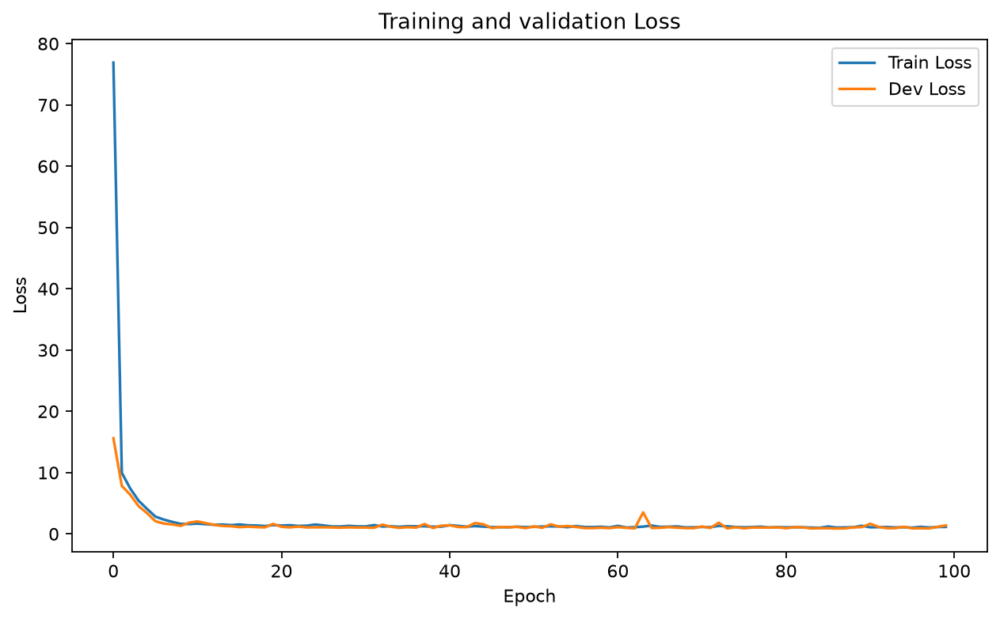
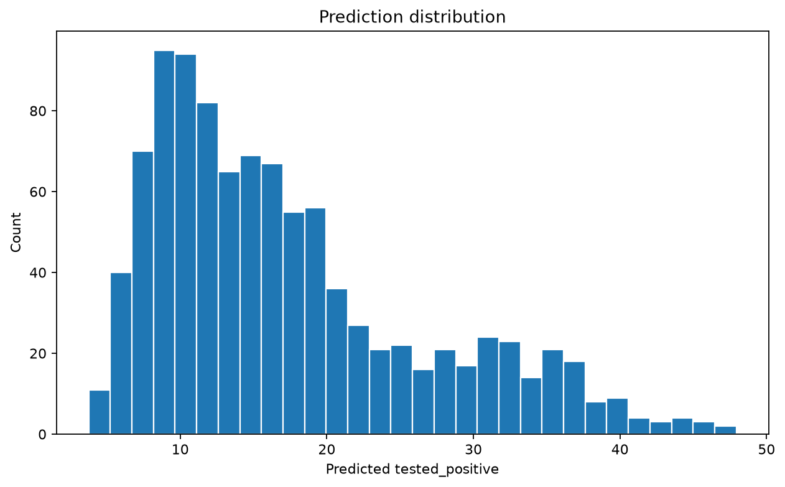

# HW1：COVID-19 阳性率回归预测

本项目对应李宏毅《机器学习》2022 Spring 的 HW1 Regression。目标是根据美国各州编码和连续三天的 COVID-19 调查特征，预测测试集的 `tested_positive` 数值。

## 文件说明

| 文件 | 内容 |
|---|---|
| `covid_train.csv` | 训练集：3,009 条样本，含 87 个输入特征和 1 个回归目标 |
| `covid_test.csv` | 测试集：997 条样本，含 87 个输入特征 |
| `covid19_regression.ipynb` | PyTorch 数据处理、训练、验证、绘图与预测代码 |
| `pred.csv` | 课程作业提交结果，共 997 条预测 |
| `results/training_curve.png` | 训练集与验证集 MSE 曲线 |
| `results/prediction_distribution.png` | 测试集预测值分布 |

## 方法

- 数据划分：序号能被 10 整除的样本作为验证集，其余样本作为训练集。
- 模型结构：`87 → 64 → 32 → 1` 的多层感知机，隐藏层使用 ReLU。
- 损失函数：均方误差（MSE）。
- 优化器：Adam，学习率为 `0.001`。
- 训练配置：batch size 为 `32`，训练 `100` 个 epoch，随机种子为 `42069`。
- 模型选择：保存验证集 MSE 最低的权重，并用最佳模型预测测试集。

## 本次运行结果

本仓库中的 notebook 已完整执行并保留输出。本次运行使用 CUDA，共读取 87 个输入特征，最佳验证集 MSE 为 **0.880995**，最终生成 997 条测试集预测。

### 训练曲线



### 预测值分布



> `pred.csv` 保留了原始提交答案。不同 PyTorch、CUDA 或硬件环境下重新训练时，末尾浮点数位可能出现极小差异；重新运行 notebook 也会覆盖当前 `pred.csv`，如需保留请先备份。

## 运行方式

建议使用 Python 3.10 或更新版本。在当前目录执行：

```bash
python -m venv .venv
```

Windows PowerShell：

```powershell
.venv\Scripts\Activate.ps1
python -m pip install -r requirements.txt
jupyter lab covid19_regression.ipynb
```

Linux / macOS：

```bash
source .venv/bin/activate
python -m pip install -r requirements.txt
jupyter lab covid19_regression.ipynb
```

在 Jupyter 中选择 **Run All Cells**。训练完成后会更新 `pred.csv`，并在 `results/` 中生成两张结果图。

如果机器没有可用的 CUDA，代码会自动切换到 CPU。

