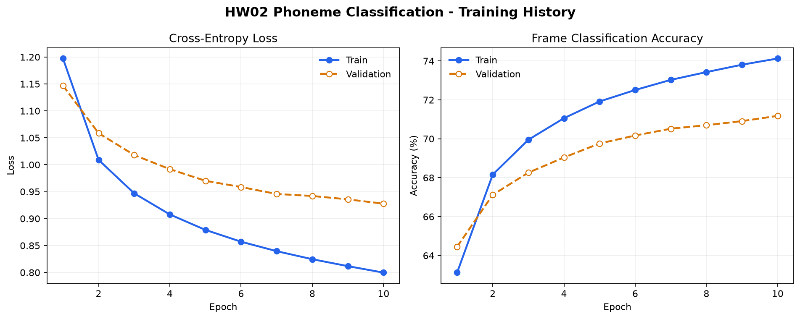

# HW02 - Phoneme Classification

使用 PyTorch 完成李宏毅 2022 Spring 机器学习课程 HW2：根据 LibriSpeech 音频的声学特征，对每一帧预测 41 个音素类别之一。

## 实验结果

本次 10 个 epoch 的实际训练记录如下：

| 指标 | Epoch 1 | Epoch 10 / 最佳结果 |
|---|---:|---:|
| Train Loss | 1.1973 | 0.7997 |
| Validation Loss | 1.1469 | 0.9277 |
| Train Accuracy | 63.12% | 74.13% |
| Validation Accuracy | 64.45% | **71.18%** |
| 测试集预测帧数 | - | 646,268 |



完整逐 epoch 数据见 [`results/training_history.csv`](results/training_history.csv)，关键参数与结果见 [`results/metrics.json`](results/metrics.json)。

## 方法

- 将当前帧与前后各 9 帧拼接，输入维度为 `19 × 39 = 741`。
- 按完整语音划分 90% 训练集和 10% 验证集，避免同一语音的帧同时出现在两个集合。
- 使用 4 层全连接网络，包含 Batch Normalization、ReLU 和 Dropout。
- 使用 Cross Entropy Loss 和 Adam 优化器。
- 将预处理后的特征按语音分块缓存，减少内存占用，并支持中断后继续处理。
- 按验证准确率保存 `best_model.pth`，最后生成 Kaggle 格式的 `submission.csv`。

## 数据集

原始数据集较大，因此存放在本仓库的 GitHub Release 中：

- [下载 ml2022spring-hw2.zip](https://github.com/lizhuofan-curry/LiHongYiML-2021-2022/releases/download/hw02-dataset-v1/ml2022spring-hw2.zip)
- 文件大小：480,098,274 bytes
- SHA-256：`DAEAAC78D7F8FA18535B93F8F8BC7537BF8FC471BAAA6FEF70F311FB74A292AB`

下载后在当前目录解压，运行代码前应得到以下关键路径：

```text
HW02 - Phoneme Classification/
├── libriphone/libriphone/
│   ├── feat/train/
│   ├── feat/test/
│   ├── train_split.txt
│   ├── test_split.txt
│   └── train_labels.txt
└── sample_submission.csv
```

## 运行

建议使用 Python 3.10 或更高版本。支持 CUDA 时会自动使用 GPU。

```bash
pip install -r requirements.txt
python phoneme_classification.py
```

第一次运行会生成 `processed_hw2/` 特征缓存，后续运行会自动跳过已经存在的 chunk。训练完成后生成：

```text
best_model.pth
submission.csv
results/
├── metrics.json
├── training_history.csv
└── training_curves.png
```

如果只需要根据已有的 `training_history.csv` 重新绘图：

```bash
python plot_training_history.py
```

## 文件说明

- `phoneme_classification.py`：数据预处理、模型训练、验证、测试预测与结果保存。
- `plot_training_history.py`：从 CSV 重新生成训练效果图。
- `requirements.txt`：Python 依赖。
- `results/`：实际训练指标和效果图。

数据集、预处理缓存、模型权重和提交文件均已加入 `.gitignore`，避免把大文件写入普通 Git 历史。
